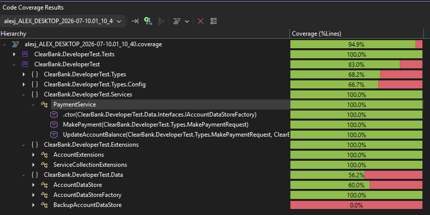

Payment Service Refactor:

Analysis:
---------

```cs
public class PaymentService : IPaymentService
{
    public MakePaymentResult MakePayment(MakePaymentRequest request)
    {
        // 1. Legacy config approach
        var dataStoreType = ConfigurationManager.AppSettings["DataStoreType"];

        Account account = null;

        // 2. Unreliable dataStoreType check
        if (dataStoreType == "Backup")
        {
            // 3. Manual instantiation of Datastore providers
            var accountDataStore = new BackupAccountDataStore();
            account = accountDataStore.GetAccount(request.DebtorAccountNumber);
        }
        else
        {
            // 3. Manual instantiation of Datastore providers
            // 4. Default to primary datastore
            var accountDataStore = new AccountDataStore();
            account = accountDataStore.GetAccount(request.DebtorAccountNumber);
        }

        var result = new MakePaymentResult();

        // 5. Defaulting to Success = true
        result.Success = true;
        
        switch (request.PaymentScheme)
        {
            case PaymentScheme.Bacs:
                // 6. DRY voilations - account == null + Success = false
                if (account == null)
                {
                    result.Success = false;
                }
                else if (!account.AllowedPaymentSchemes.HasFlag(AllowedPaymentSchemes.Bacs))
                {
                    result.Success = false;
                }
                break;

            case PaymentScheme.FasterPayments:
                if (account == null)
                {
                    result.Success = false;
                }
                else if (!account.AllowedPaymentSchemes.HasFlag(AllowedPaymentSchemes.FasterPayments))
                {
                    result.Success = false;
                }
                else if (account.Balance < request.Amount)
                {
                    result.Success = false;
                }
                break;

            case PaymentScheme.Chaps:
                if (account == null)
                {
                    result.Success = false;
                }
                else if (!account.AllowedPaymentSchemes.HasFlag(AllowedPaymentSchemes.Chaps))
                {
                    result.Success = false;
                }
                else if (account.Status != AccountStatus.Live)
                {
                    result.Success = false;
                }
                break;
        }

        if (result.Success)
        {
            account.Balance -= request.Amount;

            // 6. DRY Voilation - re-checking dataStoreType and creating a second instance of the data store
            if (dataStoreType == "Backup")
            {
                var accountDataStore = new BackupAccountDataStore();
                accountDataStore.UpdateAccount(account);
            }
            else
            {
                var accountDataStore = new AccountDataStore();
                accountDataStore.UpdateAccount(account);
            }
        }

        return result;
    }
}
```


Refactors performed:
====================

1. Legacy config approach - Convert to IOptionsMonitor  
\+
2. Unreliable dataStoreType check 
    - Create [DataStoreType](./ClearBank.DeveloperTest/Types/Config/DataStoreType.cs) enum to remove reliance on string-matched config
    - Create [DataStoreConfig](./ClearBank.DeveloperTest/Types/Config/DataStoreConfig.cs#5) record to hold `DataStoreType` property
    - Inject `IOptionsMonitor<DataStoreConfig> dataStoreConfig`
    - IOptionsMonitor allows for hot-reload of the `DataStoreType` depending on the provider used

3. Manual instantiation of Datastore providers
    - Added [AccountDataStoreFactory](./ClearBank.DeveloperTest/Data/AccountDataStoreFactory.cs#7) + [IAccountDataStoreFactory](ClearBank.DeveloperTest\Data\Interfaces\IAccountDataStoreFactory.cs#3) interface
    - Moved Injection of `IOptionsMonitor<DataStoreConfig>` into the `DataStoreFactory`
    - Added [IAccountDataStore](ClearBank.DeveloperTest\Data\Interfaces\IAccountDataStore.cs#5) interface to be implemented by both [AccountDataStore](ClearBank.DeveloperTest\Data\AccountDataStore.cs#6) and [BackupAccountDataStore](ClearBank.DeveloperTest\Data\BackupAccountDataStore.cs#5)
    - Injected `IKeyedServiceProvider` to dynamically resolve `IDataStore` based on `DataStoreType`

4. Default to primary datastore  
    - Since this is a refactoring exercise alone, I have not updated the logic here.  
    One enhancement I would make is a strong check for `DataStoreType`, and throw an `ArgumentException` here if a type wasn't found.  
    To match existing logic, the `AccountDataStoreFactory.Create()` method defaults to the `Primary` datastore, as it did previously
    This can be found [here](./ClearBank.DeveloperTest/Data/AccountDataStoreFactory.cs#13)

5. Defaulting to Success = True  
  This is dangerous and should be avoided.  This has been removed

6. DRY voilations.  
    Lots of repeated `if (account == null)` checks and `Success = false` assignments.  
    This has been completely cleaned up as part of the above changes.


Additional Enhancements:
------------------------

1. One change I made was to update the [Account](ClearBank.DeveloperTest\Types\Account.cs#3) class to record with `init` properties to add more immutability, since accounts shouldn't be easily editable.
2. While I think the [AccountExtensions](ClearBank.DeveloperTest\Extensions\AccountExtensions.cs) approach to validation is _good enough_ for the complexity here, and easier to implement within the time constraints of the test, my next step would be to further refactor these checks into their own respective `Bacs/Chaps/FasterPaymentsValidator` classes, and resolve them dynamically based on the `MakePaymentRequest.PaymentScheme` using something like `PaymentValidatorFactory.ForScheme(request.PaymentScheme)`
3. It's currently possible to request a negative payment - this needs to be prevented.
4. While the goal of this exercise was not to add logic, a productionised version of the payment service would also need to add logging, error handling, and potentially a payment rollback if the balance update fails
5. The current code is not asynchronous, so has no `async` methods, but I'd make the full stack `async` when interacting with a real database / IO

Unit Testing:
=============

Unit tests have been added for all new code, including both happy-path and negative tests, and the `PaymentService` has 100% coverage.
The majority of the validation logic is now done in [AccountExtensions.cs](ClearBank.DeveloperTest\Extensions\AccountExtensions.cs) so this is where I spent the most time testing

